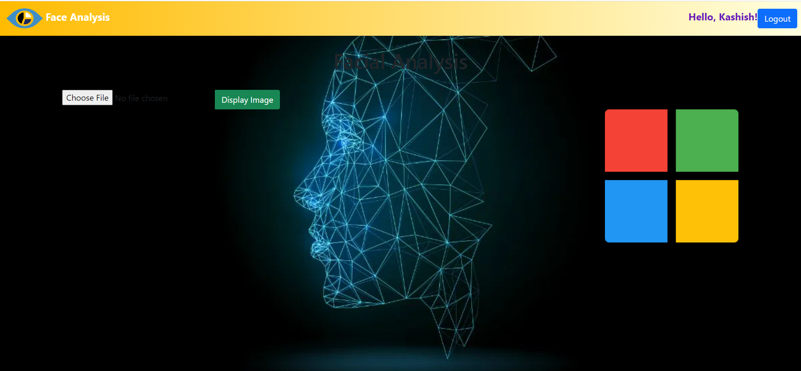
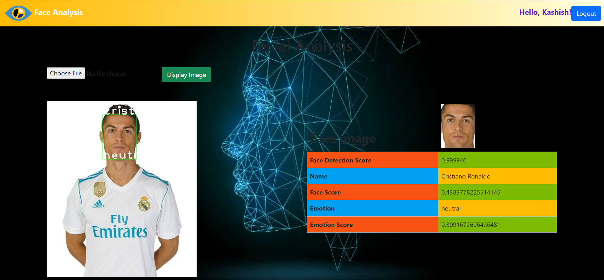
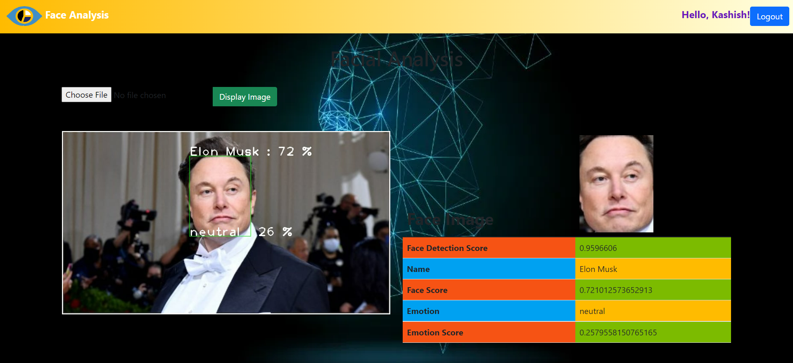
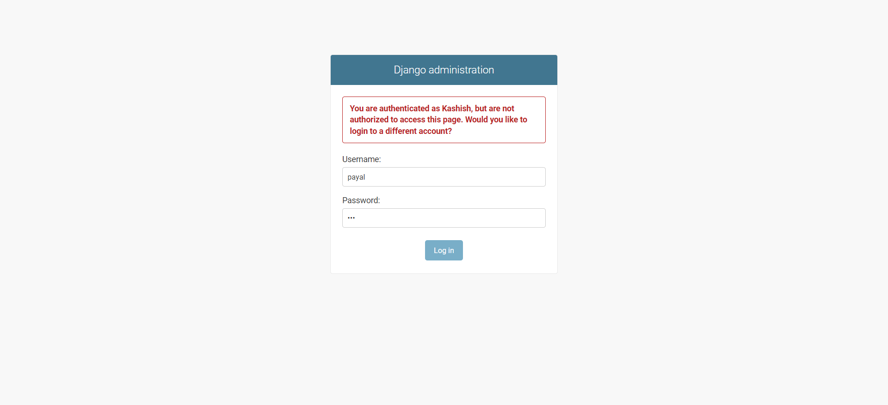
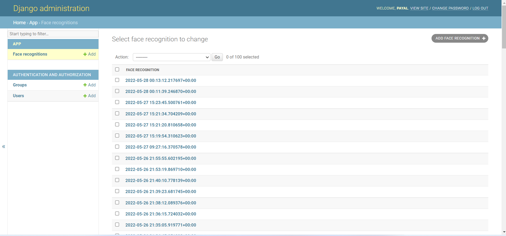
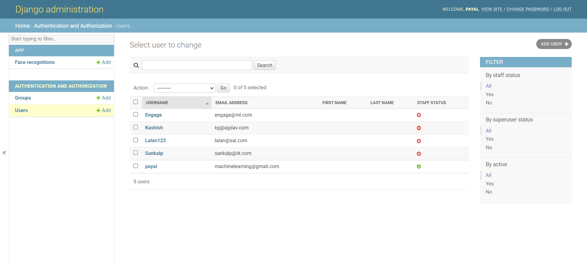

<h1 align="center">Face Recognition Emotion Detection 
  
  
</h1>
<p align="center">
  <a target="_blank" href="https://youtu.be/rpJNAE04Qcg"><b>Video Demo</b></a> 
  <a target="_blank" href="https://www.canva.com/design/DAFB-ga9_fI/TfHtofKeef1m95iMQvaDGg/view?utm_content=DAFB-ga9_fI&utm_campaign=designshare&utm_medium=link2&utm_source=sharebutton"><b>. Presentation</b></a> 
  
</p>
<!-- TABLE OF CONTENTS -->
<details open="open">
  <summary>Table of Contents</summary>
  <ol>
    <li>
      <a href="#about-the-project">About The Project</a>
      <ul>
        <li><a href="#features">Features</a></li>
        <li><a href="#compatible-platforms">Compatible Platforms</a></li>
        <li><a href="#built-with">Built With</a></li>
      </ul>
    </li>
    <li>
      <a href="#getting-started">Getting Started</a>
      <ul>
        <li><a href="#prerequisites">Prerequisites</a></li>
        <li><a href="#installation">Installation</a></li>
      </ul>
    </li>
    <li><a href="#preview-of-the-web-application">Preview of the Web Application</a></li><ul>
        <li><a href="#register">Register</a></li>
        <li><a href="#login">Login</a></li>
        <li><a href="#ui-before-uploading-the-image">UI before Uploading the image</a></li>
        <li><a href="#face-detection-results">Face Detection Results</a></li>
        <li><a href="#django-admin-user-and-web-app-data">Django Admin User and Web App Data</a></li>
      </ul>
    <li><a href="#shortcomings-and-future-aspects">Shortcomings and Future Aspects</a></li>
  </ol>
</details>

<!-- ABOUT THE PROJECT -->

## About The Project
* Face Detection Emotion Recognition project built during Microsoft Engage 2022 program. 
* It is a web application through which we can detect the name and emotion of the images uploaded based on my model created . 
* Displays the face confidence code got from my trained deep learning model.
* Displays the name and respective probability got from my trained machine learning model.
* Displays the human emotion and respective probability got from another trained machine learning model.

### Features
* User login and authentication using Django authentication system
* Creating and deleting images, adding and removing Users,designating the accessbility of users to admin site by the super user i.e me

### Compatible Platforms
Laptops and Tablets

### Built With

### Web Application: 
  <ol>
    <li>
      Languages and IDE
      <ul>
        <li>Pytnon ,HTML5...</li>
        <li>Microsoft VS Code</li>
      </ul>
    </li>
    <li>Python Libraries</li>
      <ul>
        <li>All libraries of requirements.txt file
           <ul>
               <li>numpy ,open-cv-python-headless,Pillow,sklearn,Dlib etc...</li>
           </ul>
        </li>
      </ul>
     <li>
      VS Code Extensions
      <ul>
        <li>Python ,Python for VSCode, Python Extenstion Pack ,Django</li>
        <li>HTML Snippets and HTML Boilerplate</li>
      </ul>
    </li>
     <li>
     Web Framework and Web Technologies
      <ul>
        <li>Django</li>
        <li>HTML5 ,CSS,Bootstrap and Google APIs</li>
      </ul>
    </li>
    <li>
      Database, Code Maintainance and Backend
      <ul>
        <li>SQLite3</li>
        <li>Git,GitHub and GitHub Desktop </li>
        <li>Backend :Django Admin Site</li>
      </ul>
    </li>
   
  </ol>
  
  <!-- INSTALLATIONS -->

## Getting Started
<b>NOTE:The machine learning model is created for people mentioned in <a href="celebrities_for_model.txt">celebrities_for_model.txt</a> <br></b>
To install and run the project on your local system, following are the requirements:
### Prerequisites
Make sure to install the required dependencies 
Install Python from python.org
Install Microsoft VS Code and the following Extensions:
```sh
Python ,Python for VSCode, Python Extenstion Pack ,Django ,HTML Snippets and HTML Boilerplate
```
Install CMake first to install Dlib on windows 
```sh
  pip install dlib 
```
### Installation

* Web Application
To run the web application on your local host, perform the following steps: <br>
Clone the GitHub Repo <br>
Create Virtual environment from VS Code(Windows)
```sh
  python -m venv name_of_virtual_environment 
```
```sh
  .\name_of_virtual_environment\Scripts\activate 
```
Install and freeze Requirements
```sh
  pip install -r requirements.txt 
```
```sh
  pip freeze > requirements.txt 
```
In  cmd terminal 
```sh
  python manage.py runserver
```
It will generate a local host URL and we are good to go
<!-- APP TUTORIAL-->
## Preview of the Web Application
### Register


### Login


### UI before Uploading the image



### Face Detection Results





### Django Admin User and Web App Data







## Shortcomings and Future Aspects
### Shortcomings 
* The Accuracy of the recognition is less and abrupt for some images
* Sometimes it throws an unexpected error for some images

### Improvements
* More Accuracy
* Scalability
* Error Handling
### Future Aspects
By improving the project on accuracy part and overall aspects ,it can be used in:
<ol>
  <li>Determing Happiness index</li>
  <li>Psychotherapy</li>
  <li>Fake identity detection....</li>
</ol>


